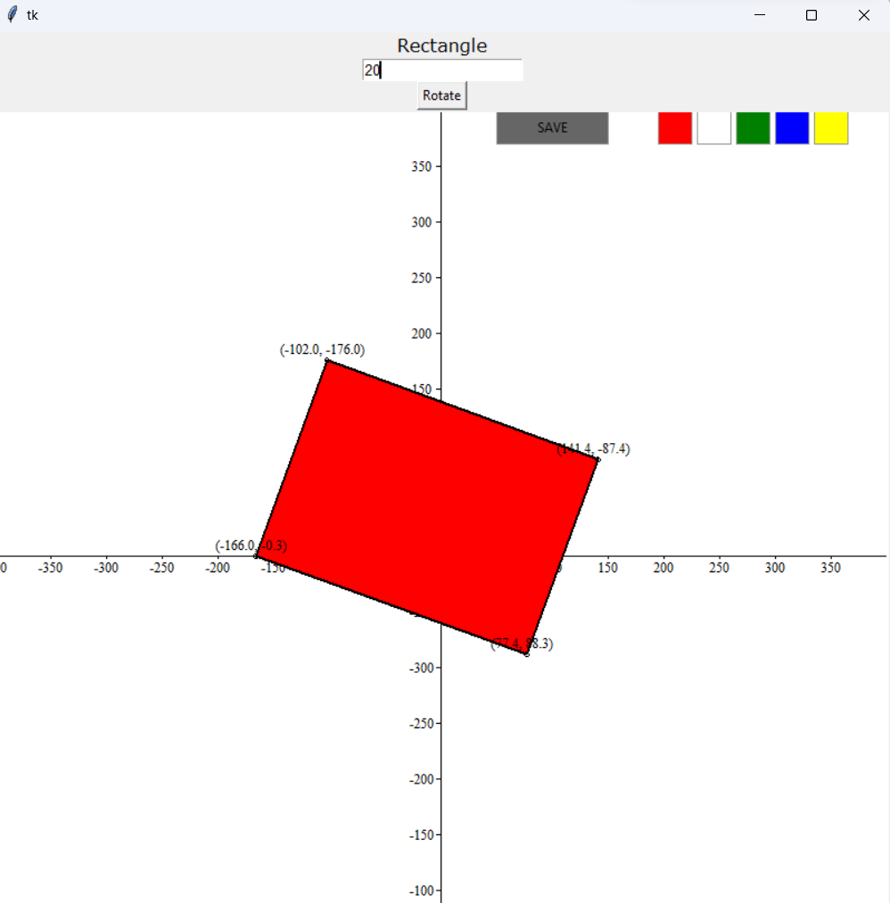

Keep shift button pressed and drag it to plot a rectangle

tap and move mouse to translate

enter angle at top and click rotate

double press it to scale

click save button it will save a rect.png image

enter python gui.py

